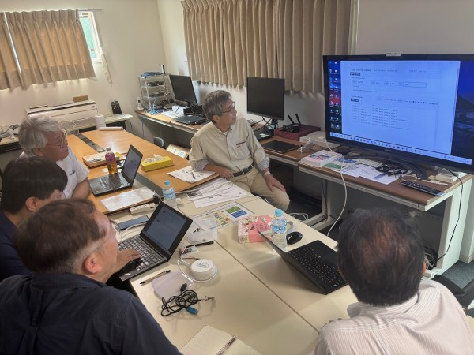
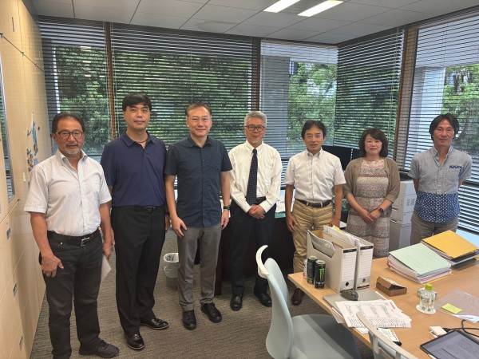

2025年8月20月（水）、台湾ETC(※1) 謝群相 氏と国立中央大学(台湾桃園市) 胡誌麟 教授がHEMS認証支援センターにご来訪されました。

台湾ETCは台湾における政府系第三者試験認証機関です。台湾で推進しているスマートホームデバイスの標準通信規格CNS 16014（TaiSEIA 101）の試験認証も行っており、日本のIoTの国際標準通信規格である「ECHONET Lite (ISO/IEC14543-4-3)」との機器連携なども研究しています。

国立中央大学とは、2024年10月に、「エネルギーマネジメントシステムに関する共同研究プロジェクト」の推進・支援に関する協相互協力・連携協定を締結(※2)しており、台湾におけるECHONET Lite技術活用の研究を推進しております。

当日は当学井上学長への表敬訪問のほか、TaiSEIAとECHONET Liteのプロトコル連携に関する技術的な情報交換などを実施しました。TaiSEIAとECHONET Liteのプロトコル連携に関しては、現在スマートハウス研究センターで本プロトコルブリッジの開発を進めており、台湾におけるエネルギーマネジメントシステムへのECHONET Lite機器活用を推進しております。また国立中央大学からは学生のTaiSEIA制御アプリなどの紹介をいただき、今後のECHONET Lite連携に関するディスカッションを実施しました。

　スマートハウス研究センターでは、今後も国際的なECHONET Lite活用に関する研究開発を推進してまいります。

(※1) 台灣 ETC：Electronics Testing Center 財團法人台灣商品檢測驗證中心（台湾製品に関する第三者試験認証機関）  
(※2) https://sh-center.sakura.ne.jp/ja/blog/2024-10-28/

   
TaiSEIAとECHONET Liteのプロトコル連携に関する技術的な情報交換などを実施

<!--   -->
学長室で記念撮影