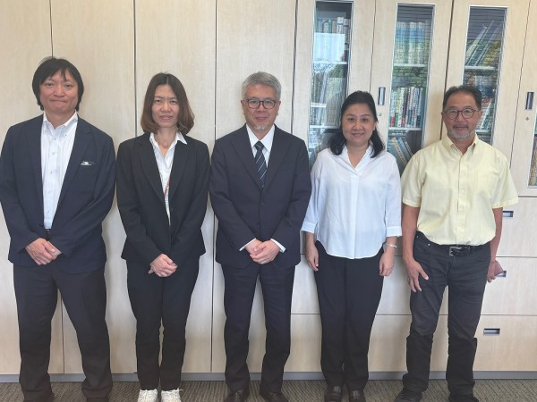
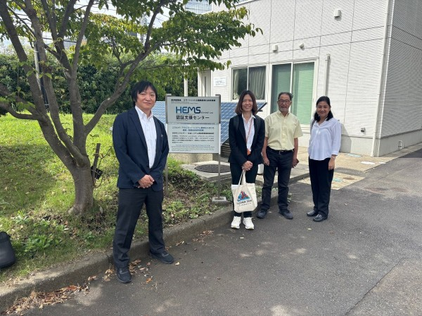
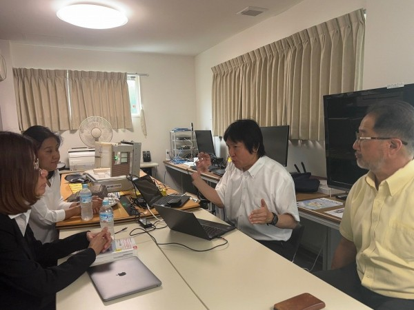

On Monday, September 22, 2025, Dr. Sukumal from Kasetsart University, Thailand, and Dr. Kalika from the National Center for Electronics and Computer Technology, Thailand, along with IEC System Committee Convener Umejima, visited Kanagawa Institute of Technology.

Dr. Sukumal and Dr. Kalika are experts in ICT and cybersecurity in Thailand. In addition, Umejima, who serves as IEC System Committee Convener (in charge of the Smart Energy Development Plan), is also involved in cybersecurity measures for energy equipment and is promoting collaboration with the Kanagawa Institute of Technology Smart House Research Center.

In addition to paying a courtesy call on our university's President, Dr. Inoue, they exchanged views on topics such as Thailand's cybersecurity response and considerations for IoT devices, and the status of cybersecurity considerations in Japan's energy management field.

In addition to a tour of the Smart House Research Center's facilities, a demonstration was also given using the ECHONET Lite SDK (software development kit) that the center has developed and made public. We also received comments that the center will consider using ECHONET Lite technology in Thailand in the future.

The Smart House Research Center will continue to promote activities to spread the use of ECHONET Lite internationally.

  
Exchange of information related to cybersecurity in the energy management field

  
Commemorative photo taken in the president's office

  
Commemorative photo in front of the HEMS Certification Support Center