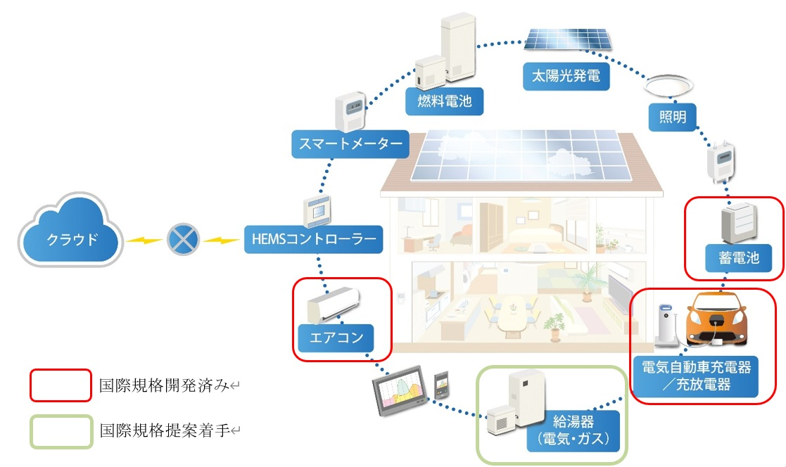

　神奈川工科大学は、一般社団法人エコーネットコンソーシアム(以下エコーネットコンソーシアム)と連携し、経済産業省からの受託事業(\*1)として令和5年度よりISO/IEC JTC 1/SC 25に「電気自動車充電器」および「電気自動車充放電器」とHEMSコントローラ間アプリケーション通信インタフェース(AIF)仕様の国際標準化提案を行ってまいりましたが、2026年6月9日に国際規格(\*2) (\*3)として発行されましたので、ご報告いたします。

　本件は、ECHONET Lite機器の海外普及を目指して、本学とエコーネットコンソーシアムの企画運営委員会傘下の国際標準化WG委員が共同にて国際標準化のための提案活動を進めてきたものです。

　エコーネットコンソーシアムは、ホームネットワーク機器間の相互接続性を向上させるために、ECHONET Lite規格の上位にアプリケーション通信インタフェース仕様の策定を進めております。これまでに、家庭用エアコン(2020年6月)および蓄電池(2023年4月)が経済産業省からの同じ体制の受託事業で国際規格として発行されております。

　この2つに続いて、再生可能エネルギーの有効活用と家庭内エネルギーマネジメントへの貢献が期待される電気自動車充電器および電気自動車充放電器の国際標準化を2023年度より進めており、今回、発行となったものです。

　現在は、ヒートポンプ給湯機とHEMSコントローラ間アプリケーション通信インタフェース仕様について提案活動を進めております。

  

なおエコーネットコンソーシアムより本件に関するニュースリリースが掲載されています。
下記URLも合わせてご参照ください。
https://echonet.jp/notification/20260901/

*1) 委託事業：省エネルギー等国際標準開発（国際電気標準分野）「電気自動車用充放電器/充電器・HEMS間AIF仕様の国際標準化」  
*2) 国際規格：ISO/IEC 14543-4-303:2026　Information technology – Home Electronic System (HES) architecture – Part 4-303: Application protocol for electric vehicle supply equipment (EVSE) chargers and controllers  
*3) 国際規格：ISO/IEC 14543-4-304:2026　Information technology – Home Electronic System (HES) architecture – Part 4-304: Application protocol for electric vehicle supply equipment (EVSE) charger and dischargers and controllers
