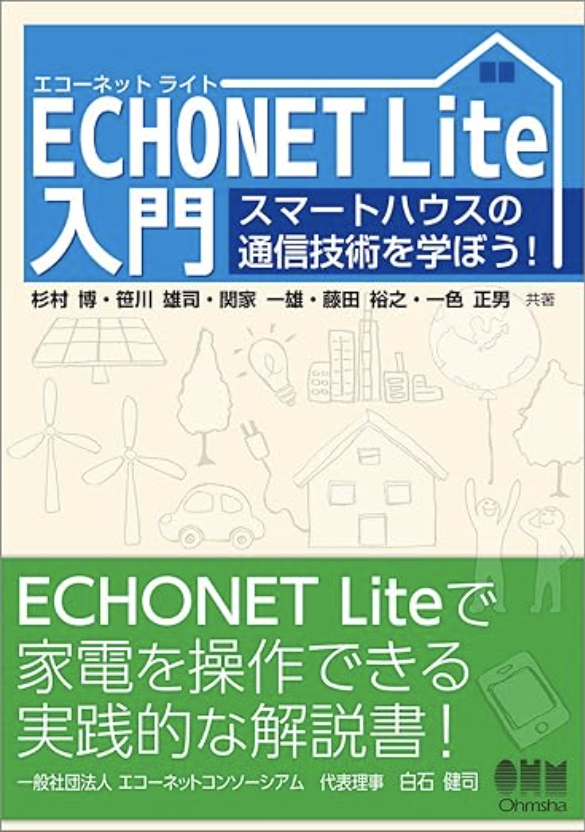
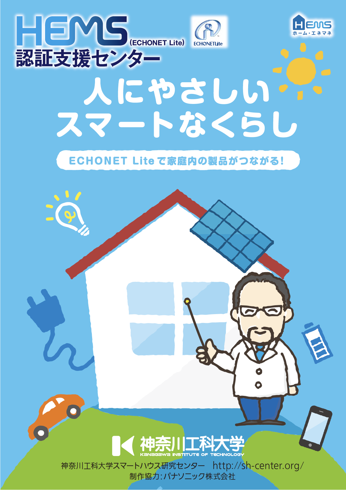
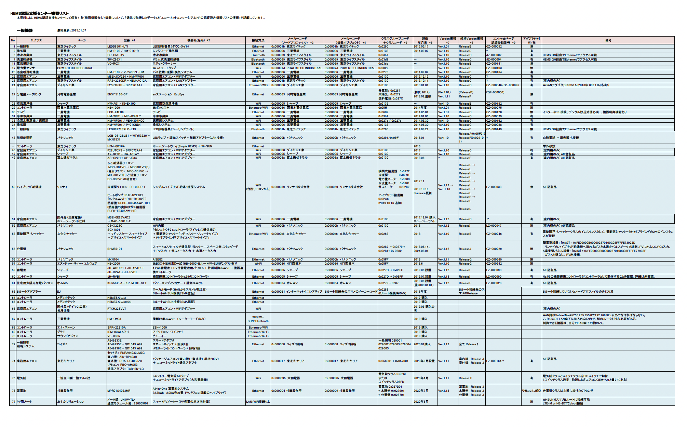
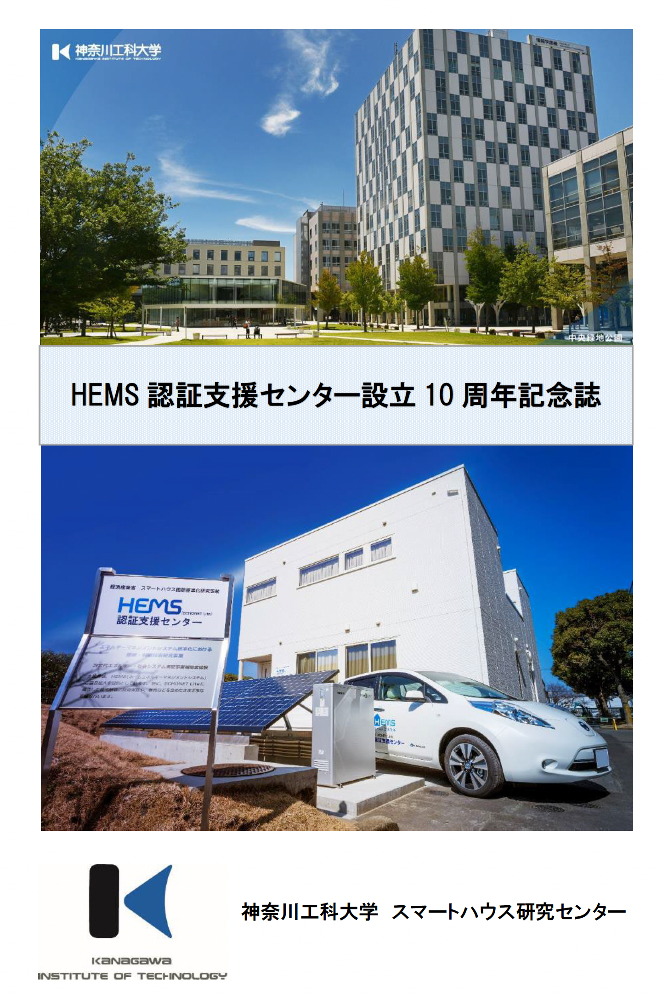

資料名|サムネール
:---|:---
[書籍：ECHONET Lite入門](https://www.amazon.co.jp/ECHONET-Lite入門-スマートハウスの通信技術を学ぼう-杉村-博/dp/4274506320)|
[HEMS（ECHONETLite）認証支援センター パンフレット](HEMS_panf2.pdf)|
[相互接続性の確認で利用できる機器リスト:2025.03.21](EquipList20250321.pdf)|
[10周年記念誌（高解像度版）](10thanniv-H.pdf) [10周年記念誌（低解像度版）](10thanniv-L.pdf)|

